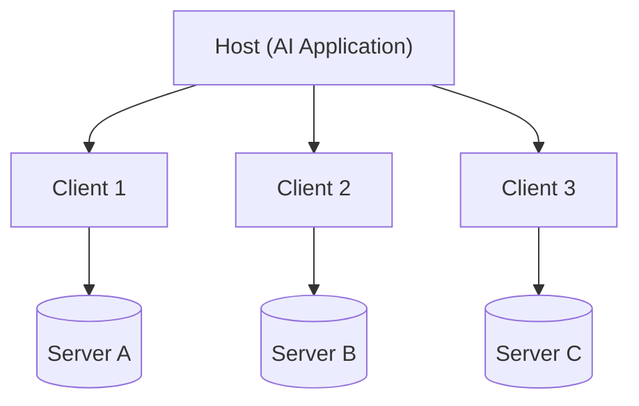
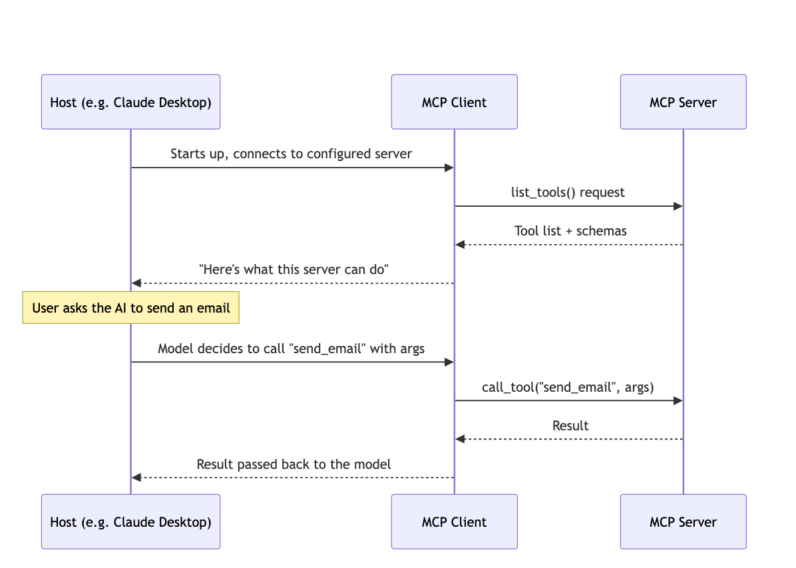
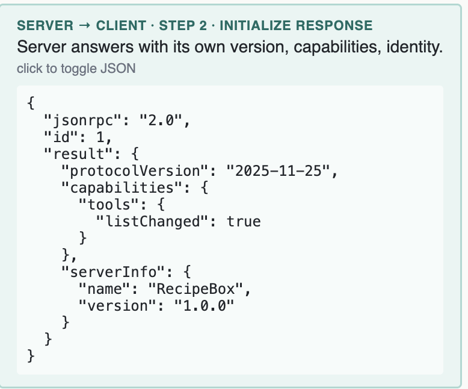
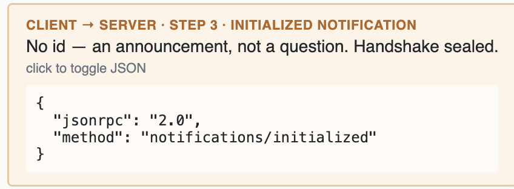
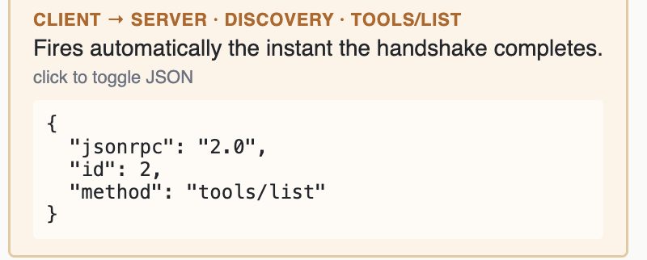
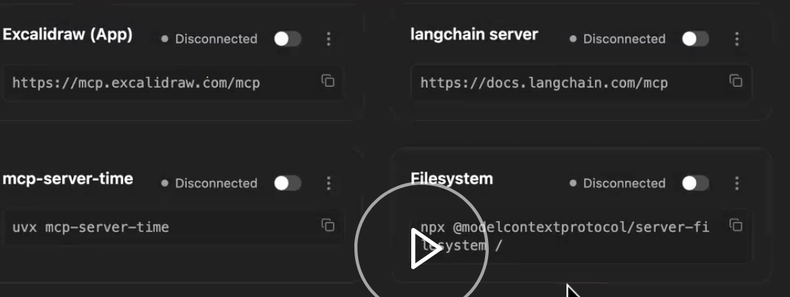
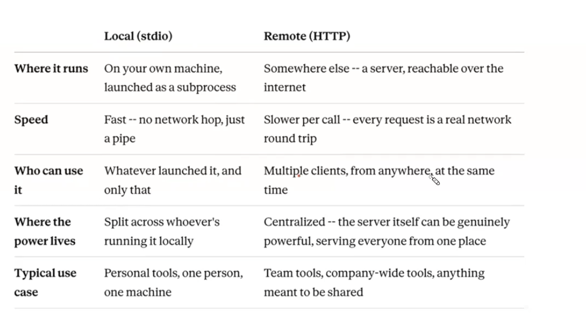
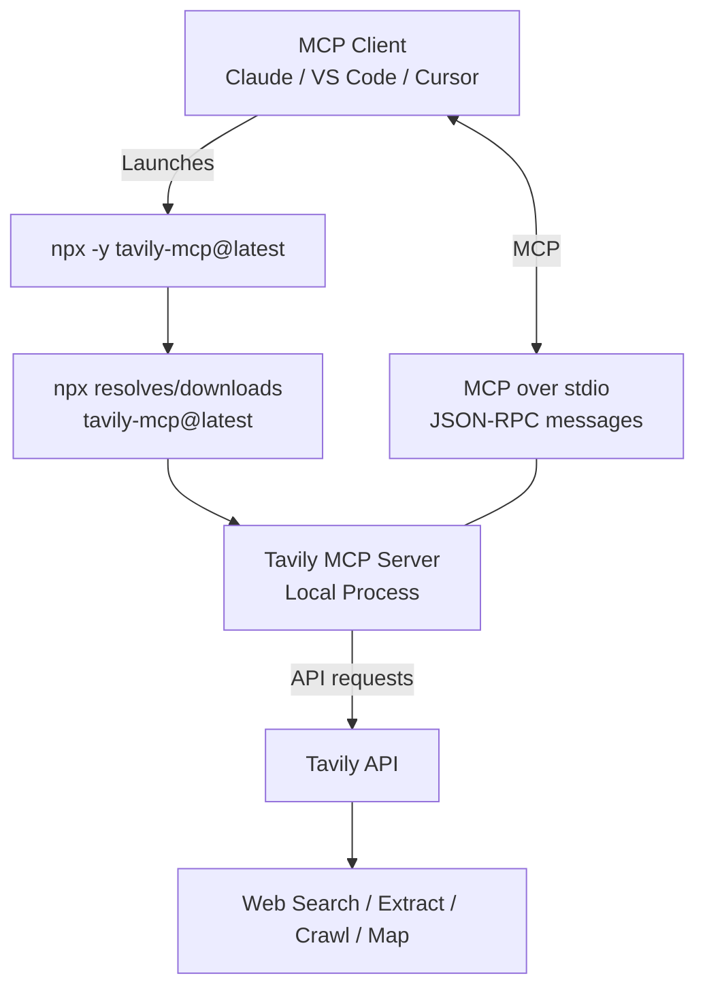
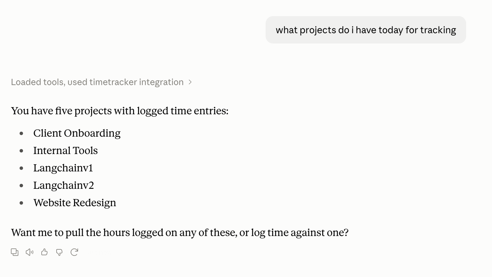
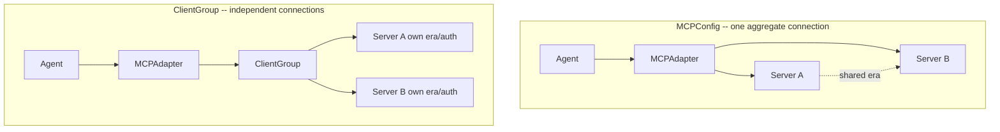

# Krish naik AgenticAI 3.0 Notes

## MCP (Model context protocol)
MCP was developed by anthropic. MCP is an opensource standard for connecting AI applications to external systems. In the begining everyone had to create custom tools that can perform operations they wanted to do example to read email, write email etc. But with MCP, email provider like gmail will provide an MCP server that contains access to all tools, and other required items such as prompt and resources. This helps model to connect as a client to those MCP servers. We can this way connect to any MCP server that we need. 
MCP server is a collection of tools which we access to perform actions. 
In claudeai connectors we see are MCP servers basically provided by different companies. 

With MCP, a developer builds one MCP server for their tool (like GitHub, Google Drive, or a local database), and any AI model that supports MCP can instantly use it.

Advantages of MCP
* Easy to define and access
* scalable - any number of users can connect to mcp
* No redundant code
* Access to all tools and applications - every application will want to create mcp servers to support more user base. 
* Less prone to failure

Negatives of MCP
* complex to set up
* many servers run locally
* less idea about implementation (inside the mcp server is blackbox)

MCP is just a shared toolbox — a standard-shaped collection of tools and APIs that any AI model can reach into, instead of every developer building their own private toolbox from scratch. Tools are what you can order. Resources are the reservation book you're allowed to check. Prompts are the pre-written specials card suggesting what to order - three different kinds of help, from one restaurant.


* Claude desktop, cursor etc is the HOST that runs the MCP client. It knows MCP protocol. 
* MCP Client calls MCP Server over STDIO or Streamable HTTP option. 
* Server calls the real API
* Result flow all the way back to the client 


When the claude desktop starts up it sends initialization message to each connector it is set up to connect to. In MCP world, there is a single host used with multiple clients to connect to multiple connector. 


For example, host is like mobile phone, client is like sim card, and connection to Jio needs one sim card, connection to airtel needs another sim card, but for all of them, they use same host. This is the underlying idea. So claude desktop uses single host to connect to all the connectors. This helps with decoupling individual connections , safety, parallelism and scalability in connections. 


Transport layer: client and server speak JSON-RPC 2.0, not plain REST. Two transport types — STDIO for local servers, Streamable HTTP for remote/hosted servers

**More notes from Mayank**

<a href="https://github.com/mayank953/Live-Class-2026/blob/main/classes_summary/16%20-%2023%20Aug%20-%20MCP%20Introduction.md" target="_blank">MCP-Host-Client-Server</a>




MCP Server contains tools, resources, prompts.

### MCP Client
HOST never connect to server directly. They use client that talks to the server. Host and Server speak the same language. 
* user ask host for send an email 
* host send this request to client
* client makes a structured request to server. They use JSON-RPC for this
* server responds with structured response
* For each MCP server, host will spin off a seperate client

This 1:1 relationship between client and server has benefits.
* scalability of clients and servers 
* security impact is minimal to individual connection
* each connection can have its own authentication mechanism
* client and server conversations can happen in parallel

### MCP Primitives

<a href="https://modelcontextprotocol.io/docs/2026-07-28/learn/server-concepts">MCP concepts documentation</a>
It explains all things a server can offer.
* **tools** - action which AI can ask server to perform (Eg: send email using gmail mcp server)
* **resources** - data sources AI can read (normally static data - Host can read this data at the begining giving host understanding of what mcp server is offering - Eg: github readme, for db server it may be schema details documentation )
* **predefined prompts** - predefined prompt template helps AI to work better

### Functions of the primitive

* MCP tools primitive has the ability to list and call tools. This helps MCP host to know what tools are available. 

| **MCP Operation** | **Purpose**              | **Returns**                            |
| ----------------- | ------------------------ | -------------------------------------- |
| **`tools/list`**  | Discover available tools | Array of tool definitions with schemas |
| **`tools/call`**  | Execute a specific tool  | Tool execution result                  |

* Resource provide static data. 

| **Method**         | **Purpose**                | **Returns**                           |
| ------------------ | -------------------------- | ------------------------------------- |
| **`resources/list`**           | List available direct resources | Array of resource descriptors          |
| **`resources/templates/list`** | Discover resource templates     | Array of resource template definitions |
| **`resources/read`**           | Retrieve resource contents      | Resource data with metadata            |
| **`subscriptions/listen`**     | Monitor resource changes        | Stream of update notifications         |

* Prompts has list and get. 

| **Method**         | **Purpose**                | **Returns**                           |
| ------------------ | -------------------------- | ------------------------------------- |
| **`prompts/list`** | Discover available prompts | Array of prompt descriptors           |
| **`prompts/get`**  | Retrieve prompt details    | Full prompt definition with arguments |


### MCP Lifecycle

* initialization \
when connection is initialized for first time 
* operation \
what operations can be performed, call tools, read resources etc
* shutdown \
where connetion is closed

**Why JSON-RPC?**
* Lightweight — plain JSON, human-readable at a glance
* Transport-agnostic — same shape over stdio or HTTP
* Two-way by design — either side can send a request
* Notifications built in — no id, fires and expects nothing back
* RPC because this allows us to call the function in a remote machine as if its a local function

MCP uses JSON-RPC 2.0 for the message format and RPC semantics, while HTTP (specifically Streamable HTTP) can be one of the transports that carries those messages.

MCP needs standardized concepts such as:

| Need                                  | JSON-RPC provides                         |
| ------------------------------------- | ----------------------------------------- |
| Request → response matching           | `id`                                      |
| Identify operation                    | `method`                                  |
| Pass arguments                        | `params`                                  |
| Standard errors                       | `error`                                   |
| Notifications                         | Messages without `id`                     |
| Bidirectional RPC-style communication | Request/response + notifications          |
| Transport independence                | Same protocol can work over stdio or HTTP |


MCP uses JSON-RPC because MCP needs a standardized, transport-independent RPC message protocol. HTTP is a transport; JSON-RPC defines how MCP requests, responses, errors, and notifications are structured. MCP can therefore run over stdio or Streamable HTTP without changing the MCP message semantics.


#### Initialization

**Structure** 
<a href="https://mcp-lifecycle.netlify.app/">mcp lifecycle docs from mayank</a>

<a href="https://modelcontextprotocol.io/specification/2025-11-25/basic/lifecycle">mcp lifecycle docs</a>

* Step 1 -
A sample request structure from client to server using json rpc 2.0


* Step 2 -
Response from server to client

The id value in response from server matches with the request from client. 
The id helps to link the response to a specific request. protocolversion has to be compatible between client and server. 

* Step 3 -
Client responds back with initialized notification. 


As client sends new request for additional calls, id value is incremeneted.
After this, they are connected for the whole session. 

| Field | Meaning |
|---|---|
| `jsonrpc` | Always `"2.0"` — identifies the JSON-RPC version |
| `id` | Identifies a request so its response/error can be matched to it |
| `method` | The operation being requested |
| `params` | Arguments supplied to the method |
| `result` | Successful response returned for a request |
| `error` | Error response returned when a request fails |


In this connection is not open, once client send request it forgets it. Server sends back another request (which is a response of request from client) to provide update. 


**Version negotiation in handshake** 

* client sends it version(latest supported)
* server sends back its version(latest supported)
* if client supports it, it moves forward, otherwise it disconnects. 


**interview question**

if you want your MCP client to work with an MCP server that was built 2 years ago, the main thing is protocol-version negotiation and backward compatibility. MCP clients ensure compatibility with older servers through protocol-version negotiation during initialization and by checking the server’s advertised capabilities.

If the server supports an older MCP version, the client uses that mutually supported version and only uses features/capabilities that the server actually supports.

**Capability negotiation in handshake** 

Capability negotiation helps to confirm what both sides can do. capabilities are added under "request" or "result" from client and server respectively. 


**In latest MCP, lifecycle is deprecated and not used**

#### Operation
During the operation phase, the client and server exchange messages according to the negotiated capabilities.
Both parties MUST:
Respect the negotiated protocol version
Only use capabilities that were successfully negotiated

**Discovery**
Discovery fires automatically the instant the handshake completes — before the user even asks a question.

In discovery tools primitive will call tools/list. The server responds back with description about the tool. After this only the actual tool call from the client side. 


**Calling**
In this phase actual tool call happens with tools/call and passing the arguments. 


#### Shutdown
"Shutdown has no goodbye message of its own. The transport closing IS the goodbye."
| Transport           | Client shutdown                                                                        | Server shutdown                                                 |
| ------------------- | -------------------------------------------------------------------------------------- | --------------------------------------------------------------- |
| **stdio**           | Close `stdin`, wait; send `SIGTERM` if it doesn't exit; use `SIGKILL` as a last resort | Server closes its output stream and exits                       |
| **Streamable HTTP** | Close the HTTP connection                                                              | Server closes unexpectedly — client should reconnect gracefully |

**<u>Transport layer connection types</u>**

shutdown depends on the type of connection made between client and server. 

**if mcp server is running locally** \
Stdio process - client connects with server running in same machine through stdio process. Example terminal running python program where terminal is client and python program is server they talk through stdio to take input and get output. If they are running on same machine just close the stdio connection is enough to shutdown. Usually in this case server is running in local machine where Host and Client exist. 
* fast connection - since both running on same system 
* secure - since both running on same system 
* simple
In STDIO, No JSON-RPC message is exchanged during shutdown at all. The entire responsibility shifts to the transport layer. Client closes its writing side (stdin) → the MCP server sees EOF on its stdin.

**if mcp server is running remote** \
Streamable http - client talks to server over http protocol using post request. client can close connection. The url is ending in /mcp. 
see this setup has local and remote connections. \



**stdio vs http streamable difference**\



**How to create MCP Server and run it locally**

MCP servers can be created and run in local. 
```
uv init mcp-warmup
uv add fastmcp
uv run python mcp_with_primitives.py
```
mcp_with_primitives.py is below
```
# Assemble the complete, final server and write it to disk

from fastmcp import FastMCP

mcp = FastMCP("Warm-Up Server")

@mcp.tool
def greet(name: str) -> str:
    """Greet someone by name."""
    return f"Hello, {name}! Welcome to MCP."

@mcp.resource("file://server-notes")
def server_notes() -> str:
    """Read-only notes about this server, straight from a local file."""
    with open("server-notes.txt") as f:
        return f.read()

@mcp.tool
def add(a: int, b: int) -> int:
    """Add two numbers together."""
    return a + b

@mcp.prompt
def structured_escalation(issue_summary: str, what_was_tried: str, customer_sentiment: str) -> str:
    """Guides the AI to log a customer escalation with every required field, in order."""
    return f"""Log this customer escalation with the following structure:
Issue Summary: {issue_summary}
What Was Already Tried: {what_was_tried}
Customer Sentiment: {customer_sentiment}
Recommended Next Action: [determine this from the details above]
"""

if __name__ == "__main__":
    mcp.run()

**accessing through inspector**
```
You can access this  through a interactive inspector UI provided by an external open-source package published by Anthropic called @modelcontextprotocol/inspector. 

```
npx -y @modelcontextprotocol/inspector uv run python mcp_with_primitives.py
opened as
http://127.0.0.1:6274/?MCP_INSPECTOR_API_TOKEN=405f2544b819e21dac9800e0047057ffeed0401e737dc923fe748b6af9185512

```

When you run npx @modelcontextprotocol/inspector, npm downloads a single, pre-bundled package from the global npm registry. Inside this package is a Vite + React + Mantine single-page web application. The Local Proxy Server: When you run the npx command, it spins up a tiny local Node.js backend proxy server on your machine (typically listening on http://localhost:6274). [1] (https://mcp.so/servers/inspector)

**using mcpjam to test your local mcpserver**

You can start up mcpjam server in your local which can provide a UI using which you can test other mcp servers like the one we set up in our local. A different port to ensure it does not compete for the same 6274 port. 
```
npx @mcpjam/inspector@latest --port 4000
```

**connect as STDIO to your local mcp server**

In this case you dont start your local mcp server example. You invoke it through MCPJAM as a subprocess. 
Now you can connect to the custom fastmcp server you created using the MCPJAM tool 
by adding the server through Add Server option. Choose STDIO for MCPJAM to start your
FASTMCP server as a seperate subprocess. You dont have to run fastmcp locally while running mcpjam. MCPJam will connect to your FASTMCP and invoke it as if its a child process or a simple python file. 

```
uv --directory <folder where python file is present> run python mcp_with_primitives.py

```


**connect as Streamable HTTP to your local mcp server**

In this case you need to start your mcp server example as HTTP process so that it has a localhost HTTP url with which it can be access.
Below command is run in the folder where your mcp server code is present. It will give you a URL like   http://127.0.0.1:8000/mcp   
```
uv run fastmcp run mcp_with_primitives.py --transport http --port 8000


uv run fastmcp run mcp_with_primitives.py
│  │   │       │
│  │   │       └── FastMCP's "run" command
│  │   └────────── FastMCP CLI
│  └────────────── uv's "run" command
└───────────────── uv
```
Using the above URL you can connect from MCPJAM now. 


**mcp libraries**

**mcp library**
* from official Claude/Anthropic
* In this version using mcp library you have to write more low level code where you have to define on your own list_tools and call_tools method and define your tools in there manually. 
<a href="https://github.com/mayank953/Live-Class-2026/blob/main/Complete%20MCP/first-mcp-server/recipebox_lowlevel.py">Low level code for recipebox example</a>
```
pip install mcp
```
**fastmcp library** 

* with this library you just define your tools alone using @mcp.tool decorator. You dont define list or call tools method yourself. 
```
pip install fastmcp
```
Both options give you MCP Inspector. 
Start code in mcp inspector using below
```
CLIENT_PORT=6280 npx @modelcontextprotocol/inspector python3 mcp_with_primitives.py
```
**Adding MCPServer in Claude desktop**

To add this MCP server as a connector to claude desktop run the below command. This will add the mcp server to claude config to start the MCP Server as STDIO process

```
uv run  fastmcp install claude-desktop recipebox_fastmcp.py
```

In claude config
```
{
  "mcpServers": {
    "recipebox": {
      "command": "uv",
      "args": [
        "run",
        "fastmcp",
        "run",
        "recipebox_fastmcp.py"
      ]
    }
  }
}
```
You can see this connector when you open claude desktop. If you want to remove it, 
go to terminal and run nano ~/Library/Application\ Support/Claude/claude_desktop_config.json
Edit the file and remove the specific server added under mcpservers file. 
CNTRL + 0 and CNTRL+X to save and exit. 

Note that in here FastMCP automatically modifies Claude Desktop's MCP configuration for you.

#### Integrate MCPServers with Claude

**Connectors**\
We can connect to third party MCP servers from our code using MCPClient using connectors. FastMCP has MCPClient and Langchain has MCPAdapter that is also a way to connect to MCPServer as a MCPClient. 


**local servers**\
we can use config file to add local mcpservers. 
if you installed local mcp server to claude using above command it wont show up in claude connectors. For that you have to go to developer -> manage your local mcp servers > Edit Config. This will open claude_desktop_config.json and you can add your local mcp server there. If you want recipebox to show up in connectors then you need to edit config to include path to uv (using which uv). Once below is saved into claude config, and now if we restart claude we can see the connector connecting to our local server. The files we link in developer tool, can be node or python or docker based. 
We can ourselves set up mcp server to start as STDIO usin claude connector as below by editing the file ourselves. 

```
{
  "mcpServers": {
    "weather": {
      "command": "uv",
      "args": [
        "--directory",
        "/ABSOLUTE/PATH/TO/PARENT/FOLDER/weather",
        "run",
        "weather.py"
      ]
    }
  }
}
```

**Starting mcpserver in vscode**\
command + shift + p -> add mcp server. Give the command as uv run fastapi run recipe_box.py.   In the generated mcp.json, change uv to full path where uv is present, Change the cwd to have current directory path of python. This should help to run the VS Code. Optionally, if needed restart VSCode using Cmd + Shift + P → Developer: Reload Window


**Not all third party servers are HTTP streamable**
You can have third party servers in STDIO as well. Example gmail server can be added into claude desktop using below
https://github.com/GongRzhe/Gmail-MCP-Server

```
{
  "mcpServers": {
    "gmail": {
      "command": "npx",
      "args": [
        "@gongrzhe/server-gmail-autoauth-mcp"
      ]
    }
  }
}
```

For Tavily search it has both options. For setting up local MCP server in claude desktop, we need to run tavily search install using node js like 
```npx -y tavily-mcp@latest```.
 This downloads and starts the Tavily MCP server locally using Node.js/npm. Tavily officially documents this as the local way to run its MCP server.\
 https://github.com/tavily-ai/tavily-mcp \
Then we can add it to claude desktop client like below
```
{
  "mcpServers": {
    "tavily-mcp": {
      "command": "npx",
      "args": ["-y", "tavily-mcp@latest"],
      "env": {
        "TAVILY_API_KEY": "your-api-key-here",
        "DEFAULT_PARAMETERS": "{\"include_images\": true, \"max_results\": 15, \"search_depth\": \"advanced\"}"
      }
    }
  }
}
```


### Time Tracker Project
You create FASTAPI and FastMCP server.
```text
                    TimeTrack
                       |
                  FastAPI App
                       |
             +---------+---------+
             |                   |
          /api/...              /mcp
             |                   |
        REST API             FastMCP
             |                   |
             +---------+---------+
                       |
                  database.py
                       |
                    SQLite
```

MCP Server code
https://github.com/amohan601/agentic-ai-learning/tree/main/krishnaik-agentic-ai-3-0/krishnaik-3-0-mcp-projects/mcp/quick-mcp


```mcp_app = mcp.http_app(path="/").```  This creates a streamable mcp server. Or use ```mcp.run()``` with transport as streamable

if you want to start your project as STDIO you should have main invocation with ```mcp.run()``` with default transport as STDIO

```app.mount("/mcp", mcp_app)``` puts that MCP HTTP application under: ```http://127.0.0.1:9998/mcp```

Note that  ```mcp.http_app(path="/")``` its not ```path="/mcp"```. The ```app.mount("/mcp", mcp_app)``` call below it already adds that prefix. Setting both doubles it into /mcp/mcp.


```app = FastAPI(title="TimeTrack", lifespan=mcp_app.lifespan)``` 
makes FastAPI manage the MCP application's lifecycle.

**connect from claude as STDIO**\
Now if you want to connect from claude desktop to this MCP and if you use
```
{
  "command": "uv",
  "args": [
    "--directory",
    ".../timetrack/",
    "run",
    "main.py"
  ]
}
``` 
That tells Claude:"Launch main.py as a local stdio MCP server." That's the problem.

Your main.py doesn't start an MCP stdio server in the timetracker project. It merely defines a fastapi app and mcp app but does not have ```if __name__ == "__main__":```

**timetracker integrated into claude desktop as STDIO**



**To start MCP server as Remote HTTP streamable**\
The correct way is 
```
uv run uvicorn main:app --port 9998 --reload
```
Now you have below. And mcp is available as Streamable HTTP in http://127.0.0.1:9998/mcp
```text
Terminal
   |
   | uv run uvicorn main:app --port 9998
   v
Uvicorn
   |
   v
FastAPI application
   |
   +------------------+------------------+------------------+
   |                  |                  |                  |
   v                  v                  v                  v
  /                  /api              /static             /mcp
   |                  |                  |                  |
   v                  v                  v                  v
Website          REST API          Static Files        FastMCP
                                                            |
                                                            v
                                                        SQLite
```


The mcp.run() defaults to stdio, so you would explicitly be choosing the stdio transport there so it can be connected from claude using claude config. Your current mcp.http_app() is choosing the HTTP/Streamable HTTP approach. 

| Approach                    | Claude starts process? | Connection                 |
| --------------------------- | ---------------------- | -------------------------- |
| **stdio**                   | Yes                    | stdin/stdout               |
| **Streamable HTTP, local**  | No                     | `http://localhost:.../mcp` |
| **Remote custom connector** | No                     | Public HTTPS URL           |


**switching between mcp and regular app (if fastapi is there)**

| Command / Setup | What it starts | Transport | Endpoint / Access |
|---|---|---|---|
| `uv run fastmcp run main.py` | FastMCP server (`TimeTrack`) only | **stdio** | MCP communicates through stdin/stdout 
| `uv run fastmcp --transport http run main.py` | FastMCP server (`TimeTrack`) only | **http** | MCP communicates through http
| `uv run uvicorn main:app --reload` | FastAPI application + mounted FastMCP server | FastMCP uses **Streamable HTTP** | FastAPI: `http://127.0.0.1:8000`<br>MCP: `http://127.0.0.1:8000/mcp/` |
| `python main.py` + `mcp.run()` | FastMCP server (`TimeTrack`) only | **stdio** | MCP communicates through stdin/stdout |
| `python main.py` + `mcp.run(transport=http)` | FastMCP server (`TimeTrack`) only | **http** | MCP communicates through http |
| `python main.py` + `uvicorn.run(app, ...)` | FastAPI application + mounted FastMCP server | FastMCP uses **Streamable HTTP** | FastAPI: `http://127.0.0.1:8000`<br>MCP: `http://127.0.0.1:8000/mcp/` |

The distinction matters: ```uv run fastmcp run main.py``` starts just the MCP server object. ```uv run uvicorn main:app``` starts the whole application — the website, the REST API, and the MCP server mounted together — because app is the FastAPI instance that has everything wired into it.

With MCP stdio, the MCP client usually starts the MCP server as a child process and communicates with it through stdin/stdout.

**start application and curl to mcp as streamable http**

Start mcp server and application as streamable http
```
uv run uvicorn main:app --port 9998 --reload
```

Now to check if mcp is started or not do a curl to mcp url to initialize the connection.
```
curl -i -X POST http://127.0.0.1:9998/mcp/ \
  -H "Content-Type: application/json" \
  -H "Accept: application/json, text/event-stream" \
  -d '{
    "jsonrpc": "2.0",
    "id": 1,
    "method": "initialize",
    "params": {
      "protocolVersion": "2025-11-25",
      "capabilities": {},
      "clientInfo": {
        "name": "curl-test",
        "version": "1.0"
      }
    }
  }
``` 
We got the response as below. we also got mcp-session-id. 
```
HTTP/1.1 200 OK
date: Sat, 19 Sep 2026 15:36:05 GMT
server: uvicorn
cache-control: no-cache, no-transform
connection: keep-alive
content-type: text/event-stream
mcp-session-id: d1247120a6a841b482984ae261e55dce
x-accel-buffering: no
Transfer-Encoding: chunked

event: message
data: {"jsonrpc":"2.0","id":1,"result":{"protocolVersion":"2025-11-25","capabilities":{"logging":{},"prompts":{"listChanged":true},"resources":{"subscribe":false,"listChanged":true},"tools":{"listChanged":true}},"serverInfo":{"name":"TimeTrack","version":"4.0.5"}}}
```

Next we send initialized curl command to mcp to indicate we are accepting this connection.
```
curl -i -X POST http://127.0.0.1:9998/mcp/ \
  -H "Content-Type: application/json" \
  -H "Accept: application/json, text/event-stream" \
  -H "Mcp-Session-Id: d1247120a6a841b482984ae261e55dce" \
  -d '{
    "jsonrpc": "2.0",
    "method": "notifications/initialized"
  }'
```

We recieved response as 
```
HTTP/1.1 202 Accepted
date: Sat, 19 Sep 2026 15:41:22 GMT
server: uvicorn
content-type: application/json
mcp-session-id: d1247120a6a841b482984ae261e55dce
content-length: 0

```
Next we can send reques to list/tools. 
```
curl -i -X POST http://127.0.0.1:9998/mcp/ \
  -H "Content-Type: application/json" \
  -H "Accept: application/json, text/event-stream" \
  -H "Mcp-Session-Id: d1247120a6a841b482984ae261e55dce" \
  -d '{
    "jsonrpc": "2.0",
    "id": 2,
    "method": "tools/list",
    "params": {}
  }'
```

Response we got. 
```
HTTP/1.1 200 OK
date: Sat, 19 Sep 2026 15:42:14 GMT
server: uvicorn
cache-control: no-cache, no-transform
connection: keep-alive
content-type: text/event-stream
mcp-session-id: d1247120a6a841b482984ae261e55dce
x-accel-buffering: no
Transfer-Encoding: chunked

event: message
data: {"jsonrpc":"2.0","id":2,"result":{"tools":[{"_meta":{"fastmcp":{"tags":[]}},"description":"Log a time entry. entry_date must be YYYY-MM-DD. Shows up on the website immediately.","inputSchema":{"properties":{"employee_name":{"type":"string"},"project":{"type":"string"},"entry_date":{"type":"string"},"hours":{"type":"number"},"description":{"default":"","type":"string"}},"required":["employee_name","project","entry_date","hours"],"type":"object","additionalProperties":false},"name":"log_time","outputSchema":{"type":"object","additionalProperties":true},"title":"Log Time"},{"_meta":{"fastmcp":{"tags":[]}},"description":"Get one employee's logged entries, optionally filtered to a date range (YYYY-MM-DD).","inputSchema":{"properties":{"employee_name":{"type":"string"},"start_date":{"default":"","type":"string"},"end_date":{"default":"","type":"string"}},"required":["employee_name"],"type":"object","additionalProperties":false},"name":"get_timesheet","outputSchema":{"properties":{"result":{"items":{"additionalProperties":true,"type":"object"},"type":"array"}},"required":["result"],"type":"object","x-fastmcp-wrap-result":true},"title":"Get Timesheet"},{"_meta":{"fastmcp":{"tags":[]}},"description":"Get total hours logged against a project, broken down by employee.","inputSchema":{"properties":{"project":{"type":"string"}},"required":["project"],"type":"object","additionalProperties":false},"name":"get_project_summary","outputSchema":{"type":"object","additionalProperties":true},"title":"Get Project Summary"},{"_meta":{"fastmcp":{"tags":[]}},"description":"List every project that has at least one logged time entry.","inputSchema":{"properties":{},"type":"object","additionalProperties":false},"name":"list_projects","outputSchema":{"properties":{"result":{"items":{"type":"string"},"type":"array"}},"required":["result"],"type":"object","x-fastmcp-wrap-result":true},"title":"List Projects"}]}}
```

**Hosting MCP HTTP server in a cloud server**

* prefect/horizon
* vercel
* docker container
* pypi
  
Login to prefect horizon and integrate the github link. Then deploy the mcp server as 
```main.py:mcp```

The drawback is this url it generated cannot connect to claude desktop because horizon requires authentication and cannot be turned off in free tier. 

We can deploy in vercel by integrating
github repo. Then turn off vercel authentication
and connect throguh claude desktop connector.
Note that vercel deployed it as a fastapi. 

**Use MCP tools when** 


You want the same tools usable from multiple clients or agents. Your time tracker now works in this chat, and would in Claude Code or Cursor, without writing any glue code.

You don't control the client. You can't add custom function definitions to Claude.ai, but you can add a connector.

You're publishing a capability for other people or teams to plug in.

Tools change independently of the apps using them. You update the server and clients pick up the changes through discovery.

#### MCP Client

MCP Client full python to using model.
https://github.com/amohan601/agentic-ai-learning/tree/main/krishnaik-agentic-ai-3-0/mcp-client-and-advanced


We can create an MCP client using the MCP or FastMCP SDK. The client can connect to an MCP server, perform initialization, discover available tools using tools/list, and invoke tools using tools/call. The tool result can then be provided to an LLM, which can interpret the result and generate the final response.

This is similar to LangChain's tool-calling loop: the LLM determines which tool to use, the application executes the tool, and the tool result is sent back to the LLM so it can generate the final response. 

LangChain's MCP integration can simplify this by discovering MCP tools and exposing them to the LangChain agent.

mcp sdk tool call
```
"""
SETUP:
    pip install mcp

RUN:
    python3 01_raw_client.py
"""
import asyncio
from mcp import ClientSession, StdioServerParameters
from mcp.client.stdio import stdio_client

# This describes HOW to start the server -- it does not start it yet.
server_params = StdioServerParameters(
    command="python3",
    args=["../main.py"],
)


async def main():
    # STEP 1: open the connection.
    async with stdio_client(server_params) as (read_stream, write_stream):
        # STEP 2: wrap a "session" around those two raw streams.
        async with ClientSession(read_stream, write_stream) as session:
            # STEP 3: the handshake.
            await session.initialize()
            print("Connected! Handshake complete.")

            # STEP 4: ask what tools exist.
            tools_response = await session.list_tools()
            tool_names = [t.name for t in tools_response.tools]
            print("Tools this server offers:", tool_names)

            # STEP 5: call one of them for real.
            result = await session.call_tool("list_projects", arguments={})
            print("Result of calling list_projects:", result)


if __name__ == "__main__":
    asyncio.run(main())
```

To run using Fast MCP as Stdio
```
import asyncio
from fastmcp import Client
    async with Client("../main.py") as client:  # steps 1, 2, AND 5 (cleanup), handled for you
        tools = await client.list_tools()  # step 3
        print("Tools:", [t.name for t in tools])

        result = await client.call_tool("list_projects", {})  # step 4
        print("Result:", result)
    # step 5 (cleanup) already happened here, automatically, the instant the block ended
```

For calling as transport call to server
```
SERVER_URL = "https://time-tracker-livid-theta.vercel.app/mcp"


async with Client(SERVER_URL) as client:
```

To make AI Model help with tool call decision
* first make list tools call to mcp server
* pass the list of tools to ai model using tools argument
* once ai tell which tool to call make the tool call and provide that response to ai to generate more readable response
* 
#### MCP changes in latest version 2026-07-28
In old system, client initialize a request and then server responds with session id. Client uses this session for the entire conversation to the end.

In the new version, it is stateless.Every message carries everything about the request. 

If nothing is "remembered" anymore, how does a server ever ask you a question in the middle of doing something? This is the neat part.

That's the whole rule, really: a server can only ask you something while it's already working on a request you sent it. It can never just show up out of nowhere.


**sampling**\
Sampling in MCP
Sampling is an MCP mechanism that lets an MCP server ask the MCP client to have an LLM generate or process something on the server's behalf.

The current MCP SDK documentation explicitly says Sampling was deprecated in 2026-07-28 and recommends calling the LLM provider API directly from the server instead.

below has code sample showing how sampling is done in older version between client and server. 
https://chatgpt.com/share/6ab7ea2a-2fe4-83e9-8bda-476d585d91fc

**elicitation**\
In MCP (Model Context Protocol), **elicitation** means the MCP server asks the user for additional information that it needs in order to complete an operation.

https://chatgpt.com/share/6ab5eb88-f374-83ea-a961-e6842335b1d4

Older MCP: server calls ctx.elicit()
Current MCP: use a resolver / multi-round-trip

The client is created with elicitation handler hook. The server calls this hook when it need a confirmation from the client and this hook method on client side is called. Client can provide the confirmation back to server. 
```
 async with Client(
        "../main.py", elicitation_handler=elicitation_handler, mode="legacy"
    )
```
What does "legacy" mean? \
It means: \
Use the older/session-based MCP initialization handshake.

With ```mode="auto"``` The client tries to negotiate the modern protocol first and falls back to the legacy handshake when necessary. 

**ping**\
client can ping the server to see if the connection is still live. it is applicable only for older server since new server mcp is stateless. 

**error handling**\
if client calls server with an invalid tool name or anything server can respond back with error which can be captured on client side

we can set up timeout when creating client and if server fails to respond back with in that time, we get exception.
```
async with Client("../main.py", timeout=1.0) as client:
```

**progress handler**\
we can set up client with a progress handler hook. Server can invoke the hook to provide periodic progress update. 
```
async with Client("../main.py", progress_handler=on_progress) as client:
```

| MCP capability | Who is being asked? | Who handles the action? | Purpose | Simple example |
|---|---|---|---|---|
| **Elicitation** | 👤 **User** | MCP **Client** collects the answer | Get information or confirmation from the **human** | Server needs the user's ZIP code |
| **Sampling** | 🤖 **LLM through the Client** | MCP **Client's LLM** generates the response | Ask an LLM to reason, generate, summarize, classify, etc. | Server asks an LLM to summarize some data |
| **Tool Call** | 🔧 **MCP Server** is being instructed | MCP **Server** executes the tool | Perform an actual operation | `create_reservation()` |
| **Resource** | 📄 **Client/LLM** consumes data | MCP **Server** provides the data | Give the client/LLM contextual information | Read a file, database record, or API data |


https://modelcontextprotocol.io/specification/2026-07-28/basic/versioning
talks about versioning related compatability between client and server running on different versions of mcp. 

Some advantages of new version
* faster routing - because of additional info in each request - Mcp-Method and Mcp-Name label, right in the headers
* smarter caching - new fields are ttlMs (how long an answer stays fresh, in milliseconds) and cacheScope (whether that cached answer is safe to share across many people, or private to just you)
* no handshake - request is sent by client and server confirms the version and responds with response


Sampling	A way for a server to ask the client's own connected AI model to help it out — say, to turn some raw data into a natural-language summary — instead of the server needing its own separate AI subscription

Elicitation	A server pausing mid-task to ask the actual person a real question — for example, confirming an unusually large action before going ahead with it

Ping	The simplest possible check — one side asking the other "are you still there?", with no other information exchanged


#### Langchain with MCP

Code for this section. 

<a href="./notebooks/langchain-mcp.ipynb">Langchain MCP notebook</a>

<a href="./MCP in Langchain/">Mayank Code changes for this section</a>

In LangChain, we can connect to an MCP server, retrieve its available
tools and tool schemas, and use those MCP tools with a LangChain agent.

We typically use `langchain-mcp-adapters` to connect MCP servers to
LangChain and convert the MCP tools into tools that LangChain agents
can use.

The newest package of mcp support from langchain is provided through `langchain-mcp`
We still get beta warning error when we use this since it is still very new. 

LangChain library is NOT used to create the MCP server itself. 

- **MCP Server** → created using the official `mcp` SDK or FastMCP.
- **MCP Client connection** → handled through the MCP client/adapter (Example langchain-mcp library).
- **LangChain Agent** → uses the MCP tools exposed by the server.

The MCPAdapter is built on top of FactMCP for creating the client. 
we can use in memory mcp server, local mcp server with main.py or remote http mcp server. Pass URL, Path to python file or mcp server app itself.

we can configure stdio explicitly as well or let MCPAdapter set it up as stdio as well. 

The adapter.list_tools() return tools information compatible to be used by langchain agent. 

https://docs.langchain.com/oss/python/langchain/mcp/tools

**setting up with python stdio transport**

This option allows us with flexibility to add log file location as well. 

```
from pathlib import Path
from langchain.mcp import MCPAdapter
from fastmcp.client.transports import PythonStdioTransport

cinebot_mcp_transport = PythonStdioTransport(
    script_path=Path("../MCP in Langchain/cinebot_mcp_server.py"),
    log_file=Path("cinebot_mcp_server.log")
)

async with MCPAdapter(cinebot_mcp_transport) as mcp_adapter:
    # Now you can use the mcp_adapter to interact with the MCP server
    tools=await mcp_adapter.list_tools()
    print("Available tools:", [t.name for t in tools])
```

**automatically creating stdio adapter without explicit stdiotransport**
```
from pathlib import Path
from langchain.mcp import MCPAdapter

stdio_adapter = MCPAdapter(Path("../MCP in Langchain/cinebot_mcp_server.py"))

tools=await stdio_adapter.list_tools()
print("Available tools:", [t.name for t in tools])
```


**In memory MCP server used by langchain mcp**

```
from fastmcp import FastMCP
mcp_inmemory = FastMCP()
@mcp_inmemory.tool
def add(a,b):
    print(f'in memory mcp adding {a} and {b}')
    return a+b

async def mcp_inmemory_func(message):
    async with MCPAdapter(mcp_inmemory) as adapter:
        tools = await adapter.list_tools()
        print([("name-",t.name, " arguments=",t.args_schema["properties"]) for t in tools])
        agent = create_agent( "openai:gpt-5-mini", tools= tools)
        print(message)
        return await agent.ainvoke({ "messages":[HumanMessage(message)]})

result = await mcp_inmemory_func('add 2 and 3 ')
print(result["messages"][-1].content)    
```

**calling the tool directly**


we can invoke the tool either directly or indirectly through agent once we get list of tools.

if we used async mcp adapter we need to ensure tool is invoked using await with ainvoke

```
showtime_tool = next((t for t in tools if t.name == "check_showtimes"), None)

    # since we are using async mcp client - mcp adapter with async we need to use await and ainvoke
    direct_result = await showtime_tool.ainvoke({"movie_title": "interstellar"})
```

when we make direct tool call the above way, it returns the mcp tool response as is directly. It does not give you ToolMessage.


| Code | What it does | Async? |
|---|---|---|
| `MCPAdapter(...)` | Creates adapter | No |
| `await adapter.list_tools()` | Talks to MCP server | Yes |
| `await tool.ainvoke(...)` | Calls MCP tool | Yes |

The adapter object can be constructed synchronously, but its operations that communicate with the MCP server are async in this API.


we can make tool call invocation in multiple ways

| Method | Example | When to use |
|---|---|---|
| **Dictionary** | `await tool.ainvoke({"movie_title": "Interstellar"})` | Most common; tool has named arguments |
| **Dictionary — multiple args** | `await tool.ainvoke({"movie_title": "Interstellar", "date": "2026-10-03"})` | Tool has multiple parameters |
| **String** | `await tool.ainvoke("Interstellar")` | Tool accepts a single string input |
| **Tool-call dictionary** | `await tool.ainvoke({"name": "check_showtimes", "args": {"movie_title": "Interstellar"}, "id": "call_123", "type": "tool_call"})` | When you already have a LangChain tool-call structure |
| **`ToolCall` object** | Pass a `ToolCall` containing `name`, `args`, `id`, and `type` | When working directly with LangChain tool-call messages |


**calling the tool using agent**


When invoking the tool using the agent, tool returns a response that the langchain adapter converts it into ToolMessage that langchain agent can understand. The agent then takes the ToolMessage and generates the AIMessage - similar to how any tool call happens with agent. MCP Adapter here is used for only connecting to the server and fetch the tool details. Rest of the tool call happens 
```
    try:
        cinebot_agent = create_agent(model='openai:gpt-5-mini',tools=tools)
        result = await cinebot_agent.ainvoke({"messages":[('user', "What are the showtimes for Interstellar?")]})
        tool_call_result = result
        print("Agent invocation result:")
        from rich import print
        print(result)
    except Exception as e:
        print("Error during agent invocation:", e)
```
In both ways agent or the tool itself uses the same MCP adapter we constructred to make the initial call to MCP that gave us the list tools. It may appear that we did not pass this adapter to agent or to direct tool invocation option. 

The returned LangChain tool retains the MCP client associated with the adapter, and that client is used to make the MCP call.

```
MCP tool definition
       +
MCP client
       ↓
LangChain Tool
       │
       ├── name
       ├── description
       ├── args_schema
       ├── metadata
       └── execution function ───────► MCP client
```
Agent only needs the langchain tool.

The agent doesn't need to know anything about MCPAdapter.
One particularly important detail from the 1.4.2 reference: the returned tool can call the MCP tool through its client on each invocation, and FastMCP clients are reentrant, so the tool can open/use the client even if you aren't currently holding an adapter connection.

**Multimodal response from MCP**

An MCP tool result isn't limited to text. langchain.mcp converts whatever the server sends — text, images, embedded files — into standard LangChain content blocks, so a model sees a uniform shape regardless of what kind of server produced it.

| MCP content type | Converts to |
|---|---|
| `TextContent` | text content block |
| `ImageContent` | image content block (base64 + mime type) |
| `ResourceLink` (image mime type) | image content block (by URL) |
| `ResourceLink` (other) | file content block |
| `EmbeddedResource` (text) | text content block |
| `EmbeddedResource` (blob) | image or file content block, by mime type |
| `AudioContent` | **not yet supported** — raises `NotImplementedError` |


**Structured output content** 

when making tool call using the tool directly using ainvoke, it by default gives the raw tool call response from mcp.
Every successful MCP tool call produces an MCP result. When the MCP result is handled by MCPAdapter as a LangChain tool call, it produces a ToolMessage; when the MCP tool result contains structured data, ToolMessage generated by the adapter will have a structured output section.

if we want to have a ToolMessage format response to be recieved we need to use tool call style arguments

```
async with MCPAdapter(cinebot_mcp_transport) as mcp_adapter:
    tools = await mcp_adapter.list_tools()
    seat_map_tool = next(t for t in tools if t.name == "get_seat_map")

    tool_call ={
        'name': 'get_seat_map',
        'args': {'movie_title': 'Interstellar'},
        'id': 'unique_call_id_12345',  # Optional: Provide a unique ID for the call
        'type':'tool_call'
    }
    # message = await seat_map_tool.ainvoke({'movie_title': 'Interstellar'}) > gives raw tool call output
    message = await seat_map_tool.ainvoke(tool_call)
    print("Text Content (what my model reads)",message.content)
    print("Structured Data (what my code can use if required)",message.artifact)
    print(message.artifact['structured_content']['available_rows'])  # Accessing structured data directly
```

| Call | Input | Result |
|---|---|---|
| `ainvoke({"movie_title": ...})` | Tool arguments | Raw tool result in your current setup |
| `ainvoke(tool_call)` | LangChain tool-call object | `ToolMessage` with `content` + `artifact` |


**By doing this the above way, we can the output of mcp tool and then extract only the relevant information we need and pass that specific information alone to agent for processing with the help of middlware to intercept the message and extract it. This will help to reduce the context window.**


If the tool has structured output content use 
```structured = message.artifact["structured_content"]``` to get the structured output.
```
## structured output
from fastmcp import FastMCP
import random 
from pydantic import BaseModel,Field
from langchain_core.messages import ToolMessage

mcp_inmemory = FastMCP()
@mcp_inmemory.tool
def reserve_seats(name: str, seats: int) -> dict:
    return {
        "name": name,
        "seats": seats,
        "id": f"R {random.randint(1,100)}"
        }

class Reservation(BaseModel):
    name: str = Field("Name of person booked")
    seats: int =Field("number of seats booked")
    id: str = Field("Booking ID")

    
async def reserve_seats_agent(message):
    async with MCPAdapter(mcp_inmemory) as adapter:
        tools = await adapter.list_tools()
        agent = create_agent( "openai:gpt-5-mini", tools= tools, response_format = Reservation)
        print(message)
        return await agent.ainvoke({ "messages":[HumanMessage(message)]})

result = await reserve_seats_agent('book one seat for aj123')
for res in result["messages"]:
    if isinstance(res, ToolMessage):
        print(res.artifact)

```
This prints out ```{'structured_content': {'name': 'aj123', 'seats': 1, 'id': 'R 83'}}```

see a sample tool message which has structured output

```
ToolMessage(
            content=[
                {
                    'type': 'text',
                    'text': '{"name":"aj123","seats":1,"id":"R 33"}',
                    'id': 'lc_0efa3407-97fb-494d-b7be-85299fb77eb7'
                }
            ],
            name='reserve_seats',
            id='0d6773e1-81b0-484e-8994-725a48c66f2e',
            tool_call_id='call_lA9bBiLzoCpaLK1wmoe2WVYY',
            artifact={'structured_content': {'name': 'aj123', 'seats': 1, 'id': 'R 33'}}
        ),
```
if we attach a response_format to our agent, the tool message will be interpreted by agent and it generates AIMessage with a structured response. 
```
'structured_response': Reservation(name='aj123', seats=1, id='R 33')
```

**Error Handling**

There are two kinds of error that happen with MCP tool call. In the first one the call to mcp server itself may fail, in the second case
mcp server may encounter exception and respond back with error. 

| Failure | What happened | What the agent sees |
|---|---|---|
| Server tool **ran and reported failure** (`isError=True`) | The tool executed, then explicitly failed (bad input, business-rule violation) | A `ToolMessage` with `status="error"` — **the agent can read it and self-correct**, same as any other tool error in this course |
| **Transport / session failure** | The connection dropped, the server crashed, or the process couldn't start | **Raises an exception** — there is no error `ToolMessage` for the model to reason about, because nothing came back to convert |

Once the tool is passed to the agent, langchain mcp adapter will generate ToolMessage for the error message from server. 
The tool message will then be interpreted by agent to provide better response. 


sample tool message format generated by the adapter.

```
ToolMessage(
    content=[
        {
            'type': 'text',
            'text': "Error calling tool 'risky_lookup': Invalid booking ID format: '12345'. Expected it to start 
with 'BK'.",
            'id': 'lc_1a38a144-c52d-4dc6-9f68-10be74247cd7'
        }
    ],
    name='risky_lookup',
    tool_call_id='bad_call_001',
    status='error'
)
```

**HITL middleware for MCP tool call**

Metadata in a MCP tool can provide additional information about the tool. 
Based on this metadata information we can add middleware to the agent to make decision.

Example would be ask middleware to interrupt for confirmation when it see destructiveHint=True in the tool metadata.

For example for below tool 
```
@mcp.tool(annotations=ToolAnnotations(destructiveHint=True))
def cancel_booking(booking_id: str) -> str:
    """Cancel an existing booking. Irreversible."""
    return f"Booking {booking_id} cancelled."

```


we can access it as 
```
for tool in tools: 
  meta = (tool.metadata or {}).get('mcp',{}).get('tool',{}).get('annotations',{})
  has_destructive_hint =  bool(meta.get('destructive_hint'))
  print(f" tool: {tool.name}, has_destructive_hint: {has_destructive_hint}")
```

The tool object returned in list_tools has below info for this tool for the cancel booking which has additional metadata

```
StructuredTool(
    name='cancel_booking',
    description='Cancel an existing booking. Irreversible.',
    args_schema={
        'type': 'object',
        'additionalProperties': False,
        'properties': {'booking_id': {'type': 'string'}},
        'required': ['booking_id']
    },
    metadata={
        'mcp': {
            'tool': {'annotations': {'destructive_hint': True}, '_meta': {'fastmcp': {'tags': []}}},
            'server': {'name': 'CineBot', 'version': '4.0.10'}
        }
    },
    handle_tool_error=<function _handle_mcp_tool_error at 0x11aa50ae0>,
    response_format='content_and_artifact',
    coroutine=<function as_langchain_tool.<locals>.call_tool at 0x12d35c040>
)
 tool: check_showtimes, has_destructive_hint: False
 tool: cancel_booking, has_destructive_hint: True
 tool: get_seat_map, has_destructive_hint: False
```

Another usecase is add requireAuthentication=True annotation to force
authentication.


**several servers with one connection**

Several servers with one connection can be done using MCPConfig dictionary.
```
CONFIG = {
    "mcpServers": {
        "weather": {"command": "python", "args": ["/path/to/weather_server.py"]},
        "calc": {"command": "python", "args": ["/path/to/calc_server.py"]},
    }
}


async def fleet_agent(config):
    async with MCPAdapter(config) as adapter:
```


**elicitation with langchain mcp**

In the new version server uses Elicit option to request cofnirmation from the client. client will see an interrupt from server and provides the interrupt response to complete elicitation. 
Context.Elicit is the old way of elicitation and not supported in the new MCP servers. 

```
class CancelConfirmation(BaseModel):
    confirm: bool = Field(description="Confirm that you want to cancel this booking.")


async def ask_cancel_confirmation(booking_id: str) -> Elicit[CancelConfirmation]:
    print("inside ask_cancel_confirmation")
    return Elicit(f"Are you sure you want to cancel booking {booking_id}?", CancelConfirmation)


@mcp.tool()
async def cancel_booking(booking_id: str, confirmation: Annotated[CancelConfirmation, Resolve(ask_cancel_confirmation)]) -> str:
    if not confirmation.confirm:
        return f"Booking {booking_id} was not cancelled."
    return f"Booking {booking_id} has been cancelled."
```


**several servers each with different connection**

Real deployments rarely talk to just one MCP server. Two patterns, with a real tradeoff:

| Pattern | What it does | Tool naming | Protocol negotiation |
|---|---|---|---|
| **`MCPConfig` dict** | One aggregate connection across several servers | Prefixed by the config key you choose | **Shared** — the whole fleet negotiates down to the oldest protocol era any member requires |
| **`ClientGroup`** | Independent connections, one per server | Namespaced `{server}_{tool}` automatically | **Independent** — each member keeps its own protocol era and auth |



If we want different auth for different servers, then use ClientGroup

```
from fastmcp.client import Client
from fastmcp.client.group import ClientGroup
from langchain.agents import create_agent
from langchain.mcp import MCPAdapter


async def agent_from_group(legacy_url: str, modern_url: str):
    # One connection per server: a `ClientGroup` keeps each server on its own
    # negotiated protocol era, so a legacy and a modern server run side by side.
    # It also namespaces every tool as `{server}_{tool}`, so two servers exposing
    # the same tool name stay distinct.
    group = ClientGroup(
        {
            "weather": Client(legacy_url, mode="legacy"),
            "calc": Client(modern_url, mode="auto"),
        }
    )
    async with MCPAdapter(group) as adapter:
```


**Authentication in MCP servers**


Most remote MCP servers require authentication. MCPAdapter delegates auth to FastMCP, so any credential a fastmcp.Client accepts works: a static bearer token, a full OAuth 2.1 flow, or any httpx.Auth.
CP servers that aren't your own local script usually need auth. This is configured on the
**FastMCP client**, not on `MCPAdapter` itself — `MCPAdapter` just wraps whatever client you hand
it (or builds a default one for a bare URL).

| Need | Pattern |
|---|---|
| Bearer token | `Client(url, auth=token)` |
| OAuth 2.1 (discovery, browser redirect, token exchange) | `Client(url, auth="oauth")` |
| Persisted OAuth across runs | `Client(url, auth=OAuth(mcp_url=url, token_storage=...))` |
| Different auth per server | `ClientGroup` with a different `auth=` on each member `Client` |
| Per-user auth in a deployment | A custom auth handler resolves the caller server-side; the graph factory mints/exchanges a token per user |

**Server level authentication with bearer token**

On MCP server side you can set up bearer token like below
```

from fastmcp.server.auth import TokenVerifier
from fastmcp.server.auth.providers import AccessToken
from mcp.types import ToolAnnotations


class CineBotTokenVerifier(TokenVerifier):

    async def verify_token(self, token: str) -> AccessToken | None:
        if token != "cinebot-secret-123":
            return None

        return AccessToken(
            token=token,
            client_id="cinebot-client",
            scopes=[],
        )


auth = CineBotTokenVerifier()

mcp = FastMCP(
    "CineBot",
    auth=auth,
)
```

Client side can be like below 
```
async def load_tools_with_bearer(url: str, token: str):
    # `auth` accepts a bearer-token string, the literal "oauth", or any httpx.Auth.
    async with MCPAdapter(Client(url, auth=token)) as adapter:
        return await adapter.list_tools()

# Must match AUTH_TOKEN in cinebot_mcp_server.py
CINEBOT_AUTH_TOKEN = "cinebot-secret-123"

# cinebot_mcp_server.py now serves over HTTP (port 8000) since the bearer
# token check only applies at a network boundary. Start it first with:
#   python cinebot_mcp_server.py

print('connect with valid auth token')
cinebot_tools = await load_tools_with_bearer("http://127.0.0.1:8000/mcp", CINEBOT_AUTH_TOKEN)
print("Tools over HTTP with bearer auth:", [t.name for t in cinebot_tools])
```


**user level authentication per user**

LangChain MCP supports per-user authentication by allowing the MCP client to connect to an MCP server using user-specific credentials, such as a Bearer/OAuth token. The MCP client includes that token when establishing the connection, and the MCP server validates it before allowing the user to access its tools. This means different users can connect to the same MCP server while the server identifies and authorizes each user independently. LangChain acts as the MCP client/tool consumer, while the MCP server remains responsible for authenticating and authorizing the user.

For a basic token-based MCP setup, imagine the user logs into an application and receives a token such as abc123. The LangChain MCP client gets that token from the application/user session and sends it to the MCP server as Authorization: Bearer abc123. The MCP server then checks that token against its own configured list/database of valid tokens (or an authentication service) and identifies which user the token belongs to. If the token is valid, the server allows the MCP tools to be called; otherwise, it returns an authentication error.

## `langchain.mcp` vs. `langchain-mcp-adapters` — What Actually Changed

If you (or a client) already has an MCP integration built on the older, separate
`langchain-mcp-adapters` package, here's the honest diff — including what the new API **doesn't**
do yet.

| | `langchain-mcp-adapters` (older, separate package) | `langchain.mcp` (this notebook, beta, built-in) |
|---|---|---|
| Install | `pip install langchain-mcp-adapters` | `pip install "langchain[mcp]>=1.4.0"` — no separate package |
| Entry point | `MultiServerMCPClient({...}).get_tools()` | `async with MCPAdapter(target) as adapter: await adapter.list_tools()` |
| Resources (`get_resources`) | ✅ Supported | ❌ **Not exposed by `MCPAdapter`** — drop to the underlying `fastmcp.Client` directly if you need this |
| Prompts (`get_prompt`) | ✅ Supported | ❌ **Not exposed by `MCPAdapter`** — same workaround |
| Tool call interceptors (`tool_interceptors`, logging/retry/`Command`-update patterns) | ✅ Supported, via `MCPToolCallRequest` | ❌ **No interceptor hook in this beta** — customize by wrapping tools yourself after `list_tools()` |
| Progress callbacks | ✅ Supported | Not part of the public `MCPAdapter` surface reviewed here |
| Structured content | Via `ToolMessage` content | `ToolMessage.artifact["structured_content"]` (typed as `MCPToolArtifact`) |
| Error handling | `handle_tool_errors` boolean flag | `isError=True` → `status="error"` automatically; transport errors raise either way |
| Tool metadata | Ungrouped | Single `tool.metadata["mcp"]` namespace (`tool.annotations`, `_meta`, `server`) |
| Elicitation | Not built in | Automatic, via LangGraph `interrupt()` |
| Status | Mature, stable | **Beta** — "actively being worked on, so the API may change" (the module's own words) |

> 🎤 **Teaching Note (for you):** the honest takeaway for a client engagement — if you need
> resources, prompts, or interceptor-style middleware around MCP calls TODAY, `langchain-mcp-adapters`
> still does things `langchain.mcp` doesn't yet. If you're starting fresh and only need tools, the
> new built-in path is where LangChain is clearly headed, and it's what today's official docs lead
> with. Don't present this as a strict "old bad, new good" — it's "different surface area, and the
> new one isn't a full superset yet."

# Live Demo for multi server mcp connection

<a href="./MCP in Langchain/MCP_MultiServer_Live_Demo.ipynb">Demo of multi server connection</a>

In this we connect to our vercel deployed time track mcp server, context 7 mcp server, and our cinebot server using langchain mcp client.
We get the tools as a list of tools and pass it to our agent. 

### Additional references

https://mcp-lifecycle.netlify.app/

https://mcp-legacy-vs-modern.netlify.app/

https://github.com/mayank953/Live-Class-2026/tree/main/Complete%20MCP

https://gofastmcp.com/clients/client

https://docs.langchain.com/oss/python/langchain/mcp#example-query-langchain-docs

<a href="./MCP in Langchain/MCP_MultiServer_Live_Demo.ipynb">Demo of multi server connection</a>

<a href="./notebooks/langchain-mcp.ipynb">Langchain MCP notebook</a>

<a href="./MCP in Langchain/">Mayank Code changes for this section</a>

<a href="https://github.com/mayank953/Live-Class-2026/blob/main/Complete%20MCP/first-mcp-server/recipebox_lowlevel.py">Low level code for recipebox example</a>

<a href="./mcp-client-and-advanced/">MCP-Warm up,Recipebox mcp, TimeTrack MCP </a>